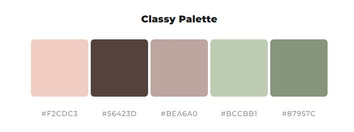

<h1 align="center">Best Friend.ie</h1>

[View the live project here]

## Responsice Mockup

Best Friend.ie is a Dog rescue shelter webpage to find new homes for rescued dogs in Ireland. The site describes the personality of each dog to help people looking for a new dog friend to connect.

The website has 3 pages, the main one helps the user to trust the shelter telling about the story of the shelter and happy stories of previous adoptions, the second page is a list of dogs available for adoption, you can read about their story and personalities. The last page is dedicated for the user to book a visit to the shelter.

## Contents

- [User Experience](#user-experience)
  - [Users Stories](#users-stories)
     - [Site Owner Goals](#site-owner-goals)
     - [Users Goals](#users-goals)
- [Design](#design)
  - [Prototype](#prototype)
  - [Typepgraphy](#typography)
    - [Primary Font](#primary-font)  
  - [Colour Palette](#colour-palette)
    - [Primary Colour](#primary-colour) 
    - [Dark Colour](#dark-colour) 
    - [White Colour](#white-colour) 
- [Features](#features)
  - [Header](#header)
  - [About Section](#about-section)
  - [Portfolio Section](#portfolio-section)
  - [Contact Section](#contact-section)
  - [Footer](#footer)
- [Testing](#testing)
  - [Browsers](#browsers)
  - [Lighthouse](#lighthouse)
    - [Desktop](#desktop)
    - [Mobile](#mobile)
  - [HTML Validation](#html-validation)
  - [CSS Validation](#css-validation)
- [Credits](#credits)
  - [Code](#code)
  - [Resources](#resources)

## User Experience

# Users Stories

#### Site Owner Goals
- I want users to easily navigate the website
- I want user to book visits to the shelter 
- I want users to see our history 
- I want users to see happy adoptions stories
- I want the user to connect with a dog through their stories

#### Users Goals
- I want to learn about the shelter
- I want to know about previous adoptions stories
- I want to visit the shelter and see the dogs 
- I want to see the dogs available for adoption

## Design 

### Prototype

Prototype was created using [Figma](https://www.figma.com/)

### Typography 
The fonts used are from [Google Fonts](https://fonts.google.com/).

#### Primary Font:
[Inter](https://fonts.google.com/specimen/Inter?query=inter)

### Colour Palette 

Colour palette was generated using [ColorSpace](https://mycolor.space/).

#### Primary Colour:
#87957C

#### Complimentary Colours:
#F2CDC3
#BEA6A0
#3B3D22
#56423D

#### White Colour: 
Alice Blue

## Features

#### Navigation Bar

Featured on all three pages, the full responsive navigation bar includes links to the Logo, Home page, Gallery and Sign Up page and is identical in each page to allow for easy navigation.
This section will allow the user to easily navigate from page to page across all devices without having to revert back to the previous page via the ‘back’ button.
Nav Bar

#### The landing page image

The landing includes a photograph with text overlay to allow the user to see exactly which location this site would be applicable to.
This section introduces the user to Love Running with an eye catching animation to grab their attention
Landing Page

#### Happy Stories

The club ethos section will allow the user to see the benefits of joining the Love Running meetups, as well as the benefits of running overall.
This user will see the value of signing up for the Love Running meetups. This should encourage the user to consider running as their form of exercise.
Club Ethos

#### About us 

This section will allow the user to see exactly when the meetups will happen, where they will be located and how long the run will be in kilometers.
This section will be updated as these times change to keep the user up to date.
Meetup Times

#### The Footer

The footer section includes links to the relevant social media sites for Love Running. The links will open to a new tab to allow easy navigation for the user.
The footer is valuable to the user as it encourages them to keep connected via social media
Footer

#### Adoption list

The gallery will provide the user with supporting images to see what the meet ups look like.
This section is valuable to the user as they will be able to easily identify the types of events the organisation puts together.
Gallery

#### The Book a Visit Page

This page will allow the user to get signed up to Love Running to start their running journey with the community. The user will be able specify if they would like to take part in road, trail or both types of running. The user will be asked to submit their full name and email address.
Sign Up

For some/all of your features, you may choose to reference the specific project files that implement them.

In addition, you may also use this section to discuss plans for additional features to be implemented in the future:

### Features Left to Implement
Another feature idea

## Testing
In this section, you need to convince the assessor that you have conducted enough testing to legitimately believe that the site works well. Essentially, in this part you will want to go over all of your project’s features and ensure that they all work as intended, with the project providing an easy and straightforward way for the users to achieve their goals.

In addition, you should mention in this section how your project looks and works on different browsers and screen sizes.

You should also mention in this section any interesting bugs or problems you discovered during your testing, even if you haven't addressed them yet.

If this section grows too long, you may want to split it off into a separate file and link to it from here.

### Validator Testing

#### HTML
No errors were returned when passing through the official W3C validator

#### CSS
No errors were found when passing through the official (Jigsaw) validator

#### Unfixed Bugs
You will need to mention unfixed bugs and why they were not fixed. This section should include shortcomings of the frameworks or technologies used. Although time can be a big variable to consider, paucity of time and difficulty understanding implementation is not a valid reason to leave bugs unfixed.

## Deployment
This section should describe the process you went through to deploy the project to a hosting platform (e.g. GitHub)

The site was deployed to GitHub pages. The steps to deploy are as follows:
In the GitHub repository, navigate to the Settings tab
From the source section drop-down menu, select the Master Branch
Once the master branch has been selected, the page will be automatically refreshed with a detailed ribbon display to indicate the successful deployment.
The live link can be found here - https://code-institute-org.github.io/love-running-2.0/index.html

## Credits
https://refine.dev/blog/css-grid-vs-flexbox/

https://michmattera.github.io/newline-alebrije/ -Grid/Flex

https://www.w3schools.com/html/html_form_input_types.asp - Form

https://stackoverflow.com/questions/9182978/semi-transparent-color-layer-over-background-image - layer background

## Content
The text for the Home page was taken from Wikipedia Article A
Instructions on how to implement form validation on the Sign Up page was taken from Specific YouTube Tutorial
The icons in the footer were taken from Font Awesome

## Media
Hero image - Victor Grabarczyk Unsplash https://unsplash.com/photos/N04FIfHhv_k

Form Image - Fabian Gieske - Unsplash - https://unsplash.com/photos/AXtlIC-eHjQ

Adoption photos

Fudge - Jamie Street - Unsplash https://unsplash.com/photos/UtrE5DcgEyg?utm_source=unsplash&utm_medium=referral&utm_content=creditShareLink