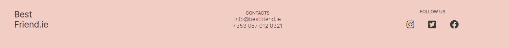
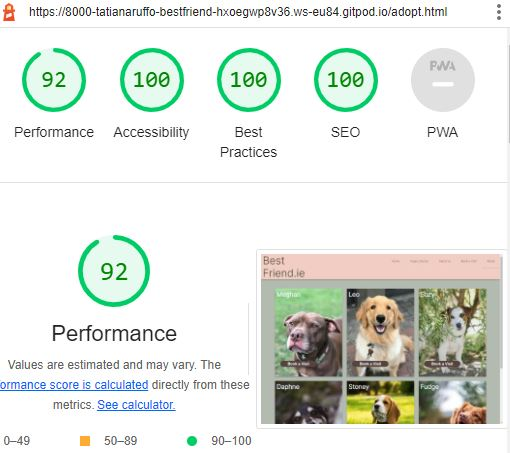

<h1>Best Friend.ie</h1>

View the live project [here](https://tatianaruffo.github.io/bestfriend/)

Best Friend.ie is a Dog rescue shelter webpage to find new homes for rescued dogs in Ireland. The site describes the personality of each dog to help people looking for a new dog friend to connect.

The website has 3 pages, the main one helps the user to trust the shelter telling about the story of the shelter and happy stories of previous adoptions, the second page is a list of dogs available for adoption, you can read about their story and personalities. The last page is dedicated for the user to book a visit to the shelter.


## Contents

- [Users Stories](#users-stories)
   - [Site Owner Goals](#site-owner-goals)
   - [Users Goals](#users-goals)
- [Design](#design)
  - [Prototype](#prototype)
  - [Typepgraphy](#typography)
    - [Primary Font](#primary-font)  
  - [Colour Palette](#colour-palette)
    - [Primary Colour](#primary-colour) 
    - [Dark Colour](#dark-colour) 
    - [White Colour](#white-colour) 
- [Features](#features)
  - [Navigation Bar](#navigation-bar)
  - [Landing Page](#landing-page)
    -[First Section](#first-section)
    -[Happy Stories](#happy-stories)
    -[About us](#about-us)
  - [Book a Visit](#book-a-visit)
  - [Adopt](#adopt)
  - [Footer](#footer)
- [Testing](#testing)
  - [Responsiveness](#responsiveness)
  - [Functional Testing](#functionaltesting)
  - [Lighthouse](#lighthouse)
    - [Desktop](#desktop)
    - [Mobile](#mobile)
  - [HTML Validation](#html-validation)
  - [CSS Validation](#css-validation)
- [Bugs](#bugs)
  - [Unfixed Bugs](#unfixedbugs)
- [Credits](#credits)
  - [Code](#code)
  - [Resources](#resources)


# Users Stories

### Site Owner Goals
- I want users to easily navigate the website
- I want user to book visits to the shelter 
- I want users to see our history 
- I want users to see happy adoptions stories
- I want the user to connect with a dog through their stories

### Users Goals
- I want to learn about the shelter
- I want to know about previous adoptions stories
- I want to visit the shelter and see the dogs 
- I want to see the dogs available for adoption

# Design 

## Prototype

Prototype was created using [Figma](https://www.figma.com/)


## Typography 
The fonts used are from [Google Fonts](https://fonts.google.com/).

### Primary Font:
[Inter](https://fonts.google.com/specimen/Inter?query=inter)

## Colour Palette 

Colour palette was generated using [ColorSpace](https://mycolor.space/).

### Primary Colour:
#B2BBAF

### Complimentary Colours:
#F2CDC3
#BEA6A0
#3B3D22
#56423D

### White Colour: 
Alice Blue

# Features

## Navigation Bar

* Desktop and laptop Navigation Menu
  * Contains links to the Home, Happy Stories, About Us, Book a Visit and Adopt pages.
  * Is identical in each page to allow for easy navigation.
  * Will allow the user to easily navigate from page to page across all devices without having to revert back to the previous page via the ‘back’ button.


* Tablet and mobile Navigation Menu
  * Hamburger menu with a dropdown options to the Home, Happy Stories, About Us, Book a Visit and Adopt pages.


## Landing page 

* The landing includes 3 sections:
  * First Section with CTA 
  * Happy Stories
  * About Us

### First Section

* Contains a hero image and a CTA button, is responsive for smaller screens 


### Happy Stories

* Happy Stories Section will allow the user to see the benefits of adopting a Dog through true stories from previous adopters


### About us 

* This Section allows the user to understand the story and purpose of the shelter


## Book a visit page

* This Section contains a form where the user can book a visit to the shelter
  * The user can choose the day of the week, period and time range to visit.
  * On successful submission of the booking form, the user will be navigated to thankyou.html displaying a thank you message.


## Adoption page

* This page allows the user to see the dogs that are ready for adoption.
  * When the user hovers the mouse on each dog picture it will show the story and personality of the dog.
  * Each picture contains a CTA button that leads to the book a visit page, allowing the user to meet the dog personally 


## The Footer

* The footer section includes links to the relevant social media sites for Best Friend and contact details. 
 * The social media links will open to a new tab to allow easy navigation for the user.
 * The email and phone are hyperlinks for easy contact for the user

 

## Features Left to Implement

* The About us section should be a separate page telling the user more about the shelter to improve trustworthy.
* A page with tips for first time pet owners 

# Testing

## Responsiveness

All pages were tested to ensure responsiveness on screen sizes from 400px and upwards on Chrome, Edge and Firefox.

Steps to test:

1. Open browser and navigate to [Best Friend.ie - Book a Visit](https://tatianaruffo.github.io/bestfriend/)
2. Open the developer tools (right click and inspect)
3. Set to responsive and decrease width to 400px
4. Set the zoom to 50%
5. Click and drag the responsive window to maximum width

Expected:

Website is responsive on all screen sizes and no images are pixelated or stretched.
No horizontal scroll is present.
No elements overlap.

Actual:

Website behaved as expected 

## Functional Testing

**Navigation Links**

Testing was performed to ensure all navigation links on the respective pages, navigated to the correct pages as per design. This was done by clicking on the navigation links on each page.

| Navigation Link | Page to Load            |
| --------------- | ---------------         |
| Home            | index.html              |
| Happy Stories   | index.html#happystories |
| About us        | index.html#aboutus      |
| Book a Visit    | form.html               |
| Adopt           | adopt.html

Links on all pages navigated to the correct pages as exptected.

**Form Testing**

The form on the home page was tested to ensure it functioned as expected when correct data was input and when incorrect data was input. The following test scenarios were covered:

_Scenario One - Correct Inputs_

Steps to test:

1. Navigate to [Best Friend.ie - Book a Visit](https://tatianaruffo.github.io/bestfriend/form.html)
2. Scroll down to the form and input the following data:
   - Name and Surname: Mary Murphy
   - Email: mary.murphy@test.com
   - Phone number: 080123456
   - Preferred meeting Date and Time: Monday/ 9am to 11am
   - Briefly describe about you and any pet you already have: This is a test.
3. Click Meet your best friend
4. User should be redirected to thankyou.html confirmation page

Expected:

Form submits with no warnings or errors and user is redirected to thankyou.html confirmation page.

Actual:

Website behaved as expected with no errors or warnings and redirected to thankyou.html.

_Scenario Two - Missing Required Field Name and Surname_

Steps to test:

1. Navigate to [Best Friend.ie - Book a Visit](https://tatianaruffo.github.io/bestfriend/form.html)
2. Scroll down to the form and input the following data:
   - Name and Surname:
   - Email: mary.murphy@test.com
   - Phone number: 080123456
   - Preferred meeting Date and Time: Monday/ 9am to 11am
   - Briefly describe about you and any pet you already have: This is a test.
3. Click Meet your best friend

Expected:

The form does not submit and an Error is displayed to tell the user that the field is required.

Actual:

Website behaved as expected, error message was displayed and the form did not submit.

_Scenario Three - Missing Required Field Email_

Steps to test:

1. Navigate to [Best Friend.ie - Book a Visit](https://tatianaruffo.github.io/bestfriend/form.html)
2. Scroll down to the form and input the following data:
   - Name and Surname: Mary Murphy
   - Email: 
   - Phone number: 080123456
   - Preferred meeting Date and Time: Monday/ 9am to 11am
   - Briefly describe about you and any pet you already have: This is a test.
3. Click Meet your best friend

Expected:

The form does not submit and an Error is displayed to tell the user that the field is required.

Actual:

Website behaved as expected, error message was displayed and the form did not submit.

_Scenario Four - Missing Required Field Phone number_

Steps to test:

1. Navigate to [Best Friend.ie - Book a Visit](https://tatianaruffo.github.io/bestfriend/form.html)
2. Scroll down to the form and input the following data:
   - Name and Surname: Mary Murphy
   - Email: marymurphy@test.com
   - Phone number: 
   - Preferred meeting Date and Time: Monday/ 9am to 11am
   - Briefly describe about you and any pet you already have: This is a test.
3. Click Meet your best friend

Expected:

The form does not submit and an Error is displayed to tell the user that the field is required.

Actual:

Website behaved as expected, error message was displayed and the form did not submit.

_Scenario Six - Incorrect email format_

Steps to test:

1. Navigate to [Best Friend.ie - Book a Visit](https://tatianaruffo.github.io/bestfriend/form.html)
2. Scroll down to the form and input the following data:
   - Name and Surname: Mary Murphy
   - Email: marymurphy.test.com
   - Phone number: 080123456
   - Preferred meeting Date and Time: Monday/ 9am to 11am
   - Briefly describe about you and any pet you already have: This is a test.
3. Click Meet your best friend

Expected:

The form does not submit and an Error is displayed to tell the user that a valid email is required and the format it should be in.

Actual:

Website behaved as expected, error message was displayed and the form did not submit.

_Scenario Seven - Missing Required Field Date and Time_

Steps to test:

1. Navigate to [Best Friend.ie - Book a Visit](https://tatianaruffo.github.io/bestfriend/form.html)
2. Scroll down to the form and input the following data:
   - Name and Surname: Mary Murphy
   - Email: marymurphy@test.com
   - Phone number: 080123456
   - Preferred meeting Date and Time:
   - Briefly describe about you and any pet you already have: This is a test.
3. Click Meet your best friend

Expected:

The form does not submit and an Error is displayed to tell the user that the field is required.

Actual:

Website behaved as expected, error message was displayed and the form did not submit.


**Footer Social Media Icons / Links**

Testing was performed on the Font Awesome Social Media icons in the footer to ensure that each one opened in a new tab.

Each item opened a new tab when clicked as expected.

**Footer Contact Information**

Testing was performed on the phone number in the contact information section of the footer to ensure behaviour was as expected.

_Steps to test Telephone Number_

1. Navigate to [Best Friend.ie - Home Page](https://tatianaruffo.github.io/bestfriend/index.html)
2. Click the phone number in the footer (+353 087 012 0321)

Expected:

A window is opened asking which device you would like to call from.

Actual:

Behavior was as expected and the window presented me with a list of options to call.

_Steps to test Email Link_

1. Navigate to [Best Friend.ie - Home Page](https://tatianaruffo.github.io/bestfriend/index.html)
2. Click the email address in the footer (info@bestfriend.ie)

Expected:

A windows popup is displayed asking what application you would like to send a mail from or your default email application is opened.

Actual:

Behavior was as expected and my outlook application was opened ready to send an email to the target address.

**Adopt CTA Page**

Testing was performed on the Book a Visit button on each dog picture to ensure behaviour was as expected.

Expected:

Button redirected to form.html page.

Actual:

Website behaved as expected and redirected to form.html.

## Lighthouse Testing

### Desktop




### Mobile


## Validator Testing

### HTML

- No errors were returned when passing through the official [W3C validator](https://validator.w3.org)


#### CSS
- No errors were found when passing through the official [Jigsaw Validator](https://jigsaw.w3.org)

[CSS Validator Results](documentation/readme-images/CSSvalidator.JPG)

## Bugs
### Unfixed Bugs
You will need to mention unfixed bugs and why they were not fixed. This section should include shortcomings of the frameworks or technologies used. Although time can be a big variable to consider, paucity of time and difficulty understanding implementation is not a valid reason to leave bugs unfixed.

## Deployment

### Version Control

The site was created using Gitpod code editor and pushed to github to the remote repository ‘bestfriend’.

The following git commands were used throughout development to push code to the remote repo:

```git add <file>``` - This command was used to add the file(s) to the staging area before they are committed. <br>
```git commit -m “commit message”``` - This command was used to commit changes to the local repository queue ready for the final step. <br>
```git push``` - This command was used to push all committed code to the remote repository on github.

### Deployment to Github Pages
- The site was deployed to GitHub pages. The steps to deploy are as follows: 
  - In the GitHub repository, navigate to the Settings tab 
  - From the menu on left select 'Pages'
  - From the source section drop-down menu, select the Branch: main
  - Click 'Save'
  - A live link will be displayed in a green banner when published successfully. 

The live link can be found here - https://tatianaruffo.github.io/bestfriend/

## Credits

### Code

https://www.w3schools.com/

https://refine.dev/blog/css-grid-vs-flexbox/

https://michmattera.github.io/newline-alebrije/ -Grid/Flex

https://www.w3schools.com/html/html_form_input_types.asp - Form

https://stackoverflow.com/questions/9182978/semi-transparent-color-layer-over-background-image - layer background

https://blog.logrocket.com/create-responsive-mobile-menu-with-css-no-javascript/ - responsive menu

### Resources 

_Images_  

Unsplash - https://unsplash.com/
The Noun Project - https://thenounproject.com/
Pixabay - https://pixabay.com/